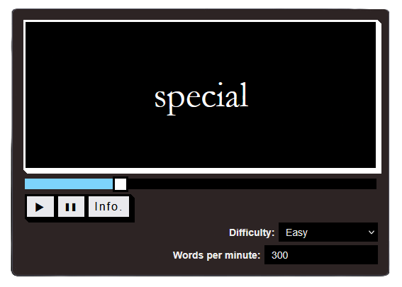

<p align="center">
  
  <h1 align="center">PractiRead</h1>
</p>

PractiRead is a free privacy-friendly and secure open-source RSVP (Rapid Serial Visual Presentation) speed reader. It allows users to highlight text on any webpage and read it back at a controlled pace, reducing subvocalization and increasing efficiency.

I built this because I don't trust the standard stack. Most free tools (and even paid ones) are just legal malware. This one isn't. The source code is available so you could read and install it yourself from it if needed.



## Zero-telemetry
There is no data collection. In fact, there is zero data transferred from this tool for any purpose, to anyone, any corporation, ever. No hidden "free, but sell your data" crap.

> [!NOTE]
> Paid tools do not necessarily value your privacy and probably not secure if the source isn't available for anyone to audit. Do you really want to trust a for-profit tool that would always be in your browser or your phone and may potentially sell your data to the highest bidder so they could advertise you junk? Or worse, sell your data to politicians so they could manipulate you better to serve the worse for-profit corporations to existence?

## On-demand execution
It doesn't sit in the background watching you. It doesn't exist until you click the icon on your toolbar. Only then does it wake up, grab the text you've explicitly highlighted and feed it to the display. Aka, a tool doing exactly what it's supposed to do and nothing  else.

## Local-only processing
When you highlight text, it stays in volatile  memory on your machine. It's never stored (never saved). It's never transmitted.

## Usage
1. Find the text you want to read.
2. Highlight it.
3. Click on the extension.
4. Press the play button.

## Install from browser's official web store
### Mozilla FireFox
TODO

### Google Chrome
TODO

### Microsoft Edge (Chromium)
TODO

### Brave (Chromium)
TODO

### Safari
Coming as soon as when I don't feel like an idiot for paying 99USD per year for a for-profit corporation just to release one free extension. What the heck, Apple? Just install from source for now (manual installation).

## Manual installation
1. Clone the repository
`git clone git@github.com:Ali-Lord/PractiRead.git`
2. Go to your browser's extension managment page (depends on the browser)
3. Enable developer mode (if needed)
4. Load the usr/ directory as an unpacked extension

If you just want to debug it, you could simply go on `about:debugging#/runtime/this-firefox` on FireFox and use the extension like in the screenshot way above (I use Librewolf as my personal browser, so I tested it on that mainly) and load the `src/manifest.json` file by clicking on "Load Temporary Add-on..." button.

## Project structure
```
src/
|- manifest.json # Security policies and permissions
|- content.js    # Tab-level text extraction
|- lib/          # Local dependencies only
|- popup/        # The reader interface and RSVP logic
```
## License
AGPL-3.0 License because people power, always.
